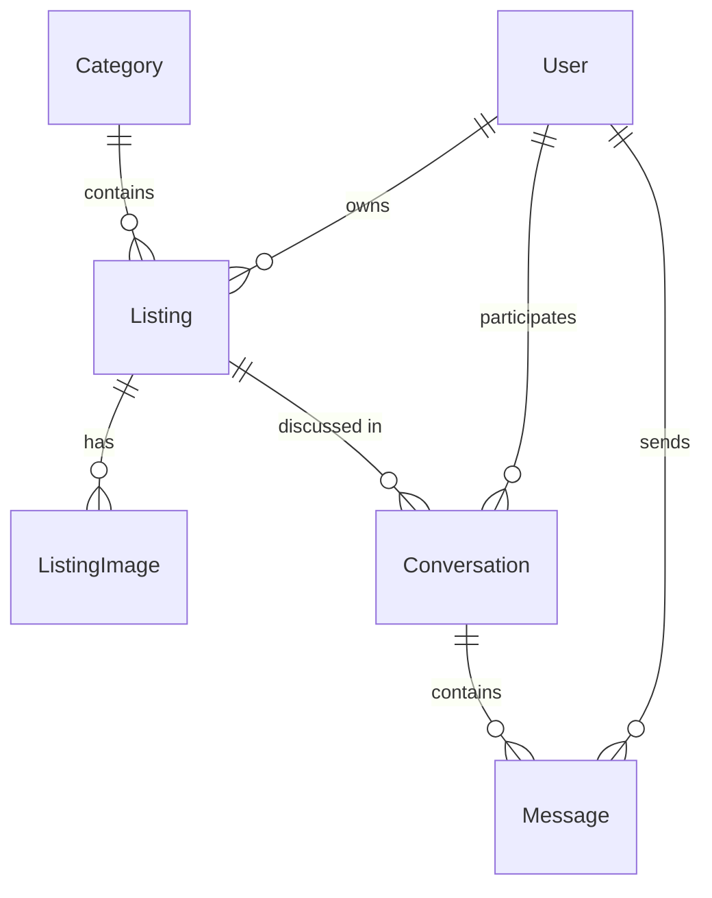

# CLAUDE.md

This file provides guidance to Claude Code (claude.ai/code) when working with code in this repository.

## What this is

A classifieds board app used as a showroom for ASP.NET web rendering models. One shared `AgoraFold.Core` (EF Core + PostgreSQL domain model plus a business/service layer) powers multiple independent front-end variants, each built with a different ASP.NET approach: MVC, Razor Pages, Blazor Server, Blazor WebAssembly, Web API + Vue, and HTMX. MVC, Razor Pages, and Web API + Vue are implemented so far, each with the full feature set (accounts, listings with images, browse/search, buyer-seller messaging).

This is a learning exercise / portfolio piece, not a production app — no deadline. Each variant gets the full feature set (accounts, images, messaging) before moving to the next. Planned build order: MVC → Razor Pages → Web API + Vue → HTMX → Blazor.

Full domain spec and feature scope: `design/project-spec.md`.

## Commands

Postgres must be running before anything that touches the database (`dotnet run`, migrations):

```
docker compose up -d
```

Build / run:

```
dotnet build
dotnet run --project src/AgoraFold.Mvc          # http://localhost:5151, https://localhost:7127
dotnet run --project src/AgoraFold.RazorPages   # http://localhost:5153, https://localhost:7129
dotnet run --project src/AgoraFold.WebApi       # http://localhost:5155, https://localhost:7131
```

The Web API variant needs its Vue client running alongside it:

```
cd src/AgoraFold.Vue
npm install     # first time only
npm run dev     # http://localhost:5173
```

All variants share the same Postgres database and can run concurrently.

EF Core migrations (run from repo root; `dotnet-ef` is a local tool restored via `.config/dotnet-tools.json`; `AgoraFold.Mvc` is the only migrations startup project — `AgoraFold.RazorPages` and `AgoraFold.WebApi` don't need `Microsoft.EntityFrameworkCore.Design` for this reason):

```
dotnet tool restore
dotnet ef migrations add <Name> --project src/AgoraFold.Core --startup-project src/AgoraFold.Mvc
dotnet ef database update --project src/AgoraFold.Core --startup-project src/AgoraFold.Mvc
```

There is no test project yet.

## Architecture

- **`AgoraFold.Core`** — persistence/domain plus business logic: entities (`Entities/`), `AppDbContext`, EF configuration, migrations, and a `Services/` layer (`ICategoryService`, `IListingService`, `IListingImageService`, `IConversationService`) that implements every business operation once so each variant just maps view models to/from it. Services throw typed exceptions (`Exceptions/`: `NotFoundException`, `ForbiddenException`, `ValidationException`) rather than returning result objects. Image files are handled through an `IListingImageStorage` abstraction (`Storage/`, default `LocalDiskListingImageStorage`) — Core never references `wwwroot` or any ASP.NET-hosting type; each variant configures the storage root path itself via `AddAgoraFoldCore()` + `Configure<ListingImageStorageOptions>`. Must never reference MVC types (`ViewResult`, `IActionResult`, etc.) — it's reused as-is by every future front-end variant.
- **`AgoraFold.Mvc`** — the MVC front-end variant. Depends on `AgoraFold.Core`; controllers map view models to/from Core entities and services. A global `AgoraFoldExceptionFilter` (`Filters/`) maps Core's typed exceptions to HTTP status codes (404/403/400), paired with `UseStatusCodePagesWithReExecute` + `HomeController.StatusCode` for friendly error pages — most actions let these exceptions bubble rather than catching them locally, except POST actions that need to redisplay a form with field errors (those catch `ValidationException` and merge it into `ModelState`). Auth is a custom `AccountController` (not the Identity Razor Pages UI scaffold) on top of `AddIdentity<AppUser, IdentityRole>()`. `Listings/Index` is the site root (default route).
- **`AgoraFold.RazorPages`** — the Razor Pages front-end variant, feature-parity port of the MVC variant onto Razor Pages (own `wwwroot`/uploads, own ports, same shared Postgres DB/migrations). Browse/search lives at `Pages/Index.cshtml` (RP's root-of-`Pages/`-is-`/` convention); everything else under `Pages/Listings/`, `Pages/Account/`, `Pages/Conversations/`. Pages with more than one POST action (`Listings/Edit` — save fields, add images, delete image; `Conversations/Details` — reply) use named handlers (`asp-page-handler`, `OnPost<Name>Async`) on one `PageModel` rather than separate pages, mirroring Mvc's multiple-actions-per-controller. `Conversations/Details.OnPostReplyAsync` deliberately returns `Page()` (not `RedirectToPage()`) on validation failure, re-rendering the thread with the just-typed reply intact — the one place RP's usual POST-redirect-GET default is overridden, to match Mvc's non-PRG `Reply` behavior. `ConversationsController`'s whole-controller `[Authorize]` becomes `options.Conventions.AuthorizeFolder("/Conversations")` in `Program.cs`. `AgoraFoldExceptionFilter` is duplicated (not shared) into `AgoraFold.RazorPages.Filters`, registered via `options.Conventions.ConfigureFilter(new AgoraFoldExceptionFilter())` (`RazorPagesOptions` has no `.Filters` collection the way `MvcOptions` does). ViewModels aren't shared with Mvc — folded directly onto PageModels as properties (Mvc's `[ValidateNever]` on server-populated/file fields has no RP equivalent needed: simply don't mark those properties `[BindProperty]`).
- **Static files gotcha**: Mvc's and RazorPages' `Program.cs` register `app.UseStaticFiles()` and `app.MapStaticAssets()` — not redundant. `MapStaticAssets()` only serves assets known at build time from a manifest; it does NOT serve listing images uploaded at runtime under `wwwroot/uploads/listings/`, so `UseStaticFiles()` must stay for those to be servable. `AgoraFold.WebApi` has no build-time static assets of its own, so it only needs `UseStaticFiles()`.
- **`AgoraFold.WebApi`** + **`AgoraFold.Vue`** — the Web API + Vue variant, split into a JSON API project and a separate Vite/Vue 3 SPA (plain JS, not TypeScript) that consumes it; the SPA is not a .NET project and isn't added to `AgoraFold.slnx`. Controllers (`Controllers/`) map DTOs (`Models/`, organized by feature) to/from the same `AgoraFold.Core` services Mvc/RazorPages use. Auth stays cookie-based `AddIdentity`, but `ConfigureApplicationCookie`'s `OnRedirectToLogin`/`OnRedirectToAccessDenied` events are overridden to return raw 401/403 instead of Identity's default 302-to-a-login-page — without this, every `[Authorize]` failure would come back as a redirect the SPA can't sensibly follow. CORS (`AddCors`/`UseCors`, before `UseAuthentication`) allows the Vue dev origin with `AllowCredentials()`. CSRF parity with Mvc/RazorPages's `[ValidateAntiForgeryToken]` uses a custom `Filters/ValidateCsrfTokenAttribute` instead of the framework attribute — the framework's `[ValidateAntiForgeryToken]` resolves DI services that only `AddControllersWithViews`/`AddMvc` register, which this API-only (`AddControllers`) project doesn't have; the custom filter calls `IAntiforgery.ValidateRequestAsync` directly. A `GET /api/antiforgery/token` endpoint (`AntiforgeryController`) hands the Vue client a token to echo back as `X-CSRF-TOKEN`. **Non-obvious gotcha**: ASP.NET's antiforgery token is bound to whichever identity (anonymous or a specific user) was active when it was issued, so the Vue client (`src/api/client.js`) fetches a fresh token before every mutating request rather than caching one — a token cached from before login/register/logout gets rejected on the next mutating call once the identity changes.
- Each future variant (Blazor, HTMX) will be its own project alongside the existing ones, depending on the same `AgoraFold.Core` (services included), added to `AgoraFold.slnx`.

### Domain model

`User` (`AppUser : IdentityUser`) owns `Listing`s, which belong to a `Category` and have many `ListingImage`s. A `Conversation` is scoped to one `Listing`, between the listing's owner and one other `User`, and contains `Message`s.



- Auth is ASP.NET Identity (`IdentityDbContext<AppUser>`), cookie-based.
- EF table/column names are snake_case (`EFCore.NamingConventions`, `UseSnakeCaseNamingConvention()` — applied both in `Program.cs` and `DesignTimeDbContextFactory`).
- `Listing.Price` is `numeric(18,2)`, nullable.
- Delete behavior: `ListingImage`, `Conversation`, `Message` cascade from their parent; `Listing.Owner`, `Conversation.Participant`, `Message.Sender` are `Restrict` (users aren't deleted out from under their content).
- `Category` rows are seeded via migration `HasData` (fixed IDs 1–7) — a listing always needs a valid `CategoryId`, so this seed is required for the app to be usable, not just sample data.

### Image storage

Local filesystem under `wwwroot/uploads/listings/{listingId}/{guid}{ext}`, one such folder per hosting project's own `wwwroot` (each variant has its own, not shared) — no cloud storage. GUID filenames avoid collisions and path traversal. Server-side validation required: file signature (magic bytes), not just extension/content-type. Limits: 5 MB/file, 8 images/listing. First image by `SortOrder` is the thumbnail. No resize pipeline for v1. Deleting a `Listing`/`ListingImage` must delete its file(s) from disk.

### Dev datastore

Postgres via `docker-compose.yml` is the only supported dev datastore (port **5433**, not the default 5432 — this avoids colliding with a native Postgres service some dev machines run on 5432). No SQLite/in-memory fallback. Connection string lives in `appsettings.json` under `ConnectionStrings:Default` and is duplicated in `DesignTimeDbContextFactory` for design-time migration commands.
