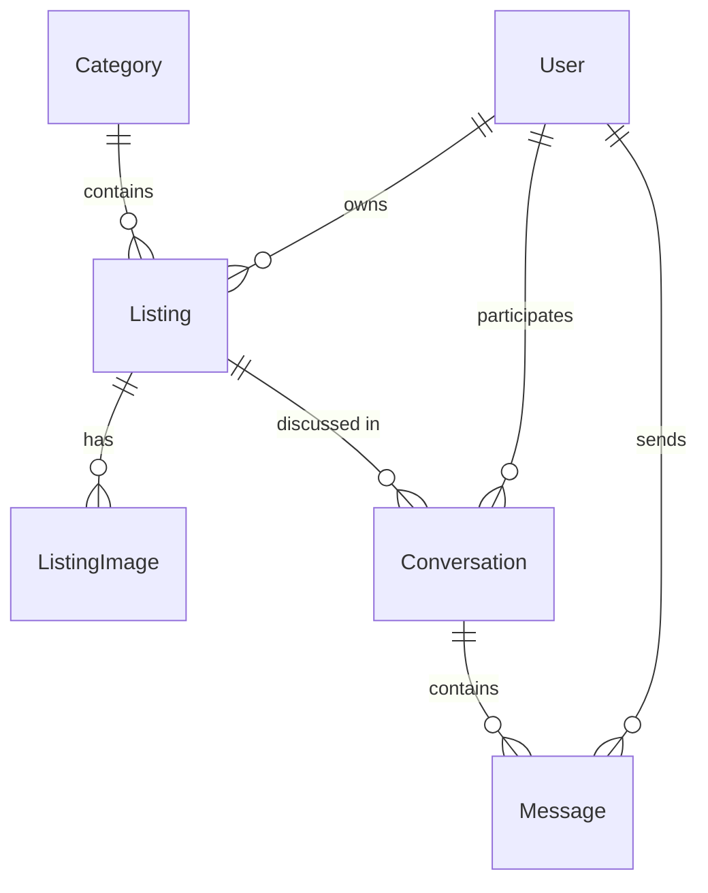

# CLAUDE.md

This file provides guidance to Claude Code (claude.ai/code) when working with code in this repository.

## What this is

A classifieds board app used as a showroom for ASP.NET web rendering models. One shared `AgoraFold.Core` (EF Core + PostgreSQL domain model plus a business/service layer) powers multiple independent front-end variants, each built with a different ASP.NET approach: MVC, Razor Pages, Blazor Server, Blazor WebAssembly, Web API + JS, and HTMX. Only the MVC variant is implemented so far, with the full feature set (accounts, listings with images, browse/search, buyer-seller messaging).

This is a learning exercise / portfolio piece, not a production app — no deadline. Each variant gets the full feature set (accounts, images, messaging) before moving to the next. Planned build order: MVC → Razor Pages → Web API + JS → HTMX → Blazor.

Full domain spec and feature scope: `design/project-spec.md`.

## Commands

Postgres must be running before anything that touches the database (`dotnet run`, migrations):

```
docker compose up -d
```

Build / run:

```
dotnet build
dotnet run --project src/AgoraFold.Mvc
```

EF Core migrations (run from repo root; `dotnet-ef` is a local tool restored via `.config/dotnet-tools.json`):

```
dotnet tool restore
dotnet ef migrations add <Name> --project src/AgoraFold.Core --startup-project src/AgoraFold.Mvc
dotnet ef database update --project src/AgoraFold.Core --startup-project src/AgoraFold.Mvc
```

There is no test project yet.

## Architecture

- **`AgoraFold.Core`** — persistence/domain plus business logic: entities (`Entities/`), `AppDbContext`, EF configuration, migrations, and a `Services/` layer (`ICategoryService`, `IListingService`, `IListingImageService`, `IConversationService`) that implements every business operation once so each variant just maps view models to/from it. Services throw typed exceptions (`Exceptions/`: `NotFoundException`, `ForbiddenException`, `ValidationException`) rather than returning result objects. Image files are handled through an `IListingImageStorage` abstraction (`Storage/`, default `LocalDiskListingImageStorage`) — Core never references `wwwroot` or any ASP.NET-hosting type; each variant configures the storage root path itself via `AddAgoraFoldCore()` + `Configure<ListingImageStorageOptions>`. Must never reference MVC types (`ViewResult`, `IActionResult`, etc.) — it's reused as-is by every future front-end variant.
- **`AgoraFold.Mvc`** — the MVC front-end variant. Depends on `AgoraFold.Core`; controllers map view models to/from Core entities and services. A global `AgoraFoldExceptionFilter` (`Filters/`) maps Core's typed exceptions to HTTP status codes (404/403/400), paired with `UseStatusCodePagesWithReExecute` + `HomeController.StatusCode` for friendly error pages — most actions let these exceptions bubble rather than catching them locally, except POST actions that need to redisplay a form with field errors (those catch `ValidationException` and merge it into `ModelState`). Auth is a custom `AccountController` (not the Identity Razor Pages UI scaffold) on top of `AddIdentity<AppUser, IdentityRole>()`. `Listings/Index` is the site root (default route).
- **Static files gotcha**: `Program.cs` registers both `app.UseStaticFiles()` and `app.MapStaticAssets()` — not redundant. `MapStaticAssets()` only serves assets known at build time from a manifest; it does NOT serve listing images uploaded at runtime under `wwwroot/uploads/listings/`, so `UseStaticFiles()` must stay for those to be servable.
- Each future variant (Razor Pages, Blazor, Web API + JS, HTMX) will be its own project alongside `AgoraFold.Mvc`, depending on the same `AgoraFold.Core` (services included), added to `AgoraFold.slnx`.

### Domain model

`User` (`AppUser : IdentityUser`) owns `Listing`s, which belong to a `Category` and have many `ListingImage`s. A `Conversation` is scoped to one `Listing`, between the listing's owner and one other `User`, and contains `Message`s.



- Auth is ASP.NET Identity (`IdentityDbContext<AppUser>`), cookie-based.
- EF table/column names are snake_case (`EFCore.NamingConventions`, `UseSnakeCaseNamingConvention()` — applied both in `Program.cs` and `DesignTimeDbContextFactory`).
- `Listing.Price` is `numeric(18,2)`, nullable.
- Delete behavior: `ListingImage`, `Conversation`, `Message` cascade from their parent; `Listing.Owner`, `Conversation.Participant`, `Message.Sender` are `Restrict` (users aren't deleted out from under their content).
- `Category` rows are seeded via migration `HasData` (fixed IDs 1–7) — a listing always needs a valid `CategoryId`, so this seed is required for the app to be usable, not just sample data.

### Image storage (MVC variant)

Local filesystem under `wwwroot/uploads/listings/{listingId}/{guid}{ext}` — no cloud storage. GUID filenames avoid collisions and path traversal. Server-side validation required: file signature (magic bytes), not just extension/content-type. Limits: 5 MB/file, 8 images/listing. First image by `SortOrder` is the thumbnail. No resize pipeline for v1. Deleting a `Listing`/`ListingImage` must delete its file(s) from disk.

### Dev datastore

Postgres via `docker-compose.yml` is the only supported dev datastore (port **5433**, not the default 5432 — this avoids colliding with a native Postgres service some dev machines run on 5432). No SQLite/in-memory fallback. Connection string lives in `appsettings.json` under `ConnectionStrings:Default` and is duplicated in `DesignTimeDbContextFactory` for design-time migration commands.
