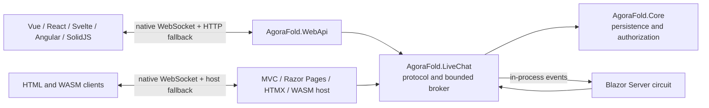

# Live-chat porting plan

## Status

Planned on 2026-07-23. The Web API + Vue implementation is complete and is the behavioral reference. Nine variants remain: MVC, Razor Pages, HTMX, Blazor Server, Blazor WebAssembly, React, Svelte, Angular, and SolidJS. Implementation notes from codebase exploration (exact file paths, framework adaptations, machine gotchas) were merged into this document on 2026-07-23, before implementation started.

## Resuming with zero session context

1. Read this document, then `webapi-architecture.md` § "WebSocket messaging" (the protocol contract), then `backlog.md` — check the live-chat task's Status line for which phases are already done, and re-check the backlog for externally-added findings.
2. Find the first phase not marked done and execute it. Each phase is independently shippable; commit at least once per phase.
3. Reference implementation to port from: backend `src/AgoraFold.WebApi/Messaging/` + `Models/Conversations/ConversationWebSocketMessage.cs`; client `src/AgoraFold.Vue/src/views/ConversationThreadView.vue` + `src/api/conversations.ts` + `src/api/client.ts`; tests `tests/AgoraFold.WebApi.Tests/ConversationWebSocketManagerTests.cs` and `src/AgoraFold.Vue/src/views/ConversationThreadView.spec.ts`.
4. Postgres must be running: `docker compose up -d` (port 5433).
5. When all ten matrix rows have passed, mark the backlog task complete and fold anything retrospective-worthy into the per-variant `-architecture.md` docs.

## Goal

Give every showroom variant equivalent live conversation-thread behavior:

- a message committed after a thread connects appears without a manual refresh;
- socket/circuit reconnects reload persisted history before resuming live delivery;
- every arrival path merges by persisted message ID and renders in canonical `sentAt`, then `id`, order;
- an ambiguous send can be retried without inserting a duplicate;
- an unavailable live transport falls back to the variant's existing HTTP or interactive-server reply path;
- authentication and conversation participation are checked at connection time and while the connection remains open.

Vue's observable behavior and the protocol documented in `webapi-architecture.md` are normative. A port is not complete merely because it can append a WebSocket event to the page.

## Scope boundaries

- Live updates apply to an open conversation thread. Live inbox reordering, unread counts, presence, typing indicators, and delivery/read receipts remain out of scope; the domain model has no read-state or presence data.
- `AgoraFold.Core` keeps persistence, authorization rules, validation, and idempotency. WebSocket connection management remains a hosting concern and must not introduce ASP.NET types into Core.
- The existing native JSON WebSocket protocol remains stable. Do not create framework-specific wire protocols.
- The in-memory connection broker provides single-process delivery, matching the current application topology. A distributed backplane is out of scope.
- HTTP reply endpoints and non-JavaScript forms remain supported. Live chat is progressive enhancement, not the only way to send a message.

## Required invariants

Every port must preserve these properties from the hardened Vue implementation:

1. **Persist before publish.** Authorize and save through `IConversationService`; only then publish the persisted message.
2. **Idempotent sends.** Generate one `clientMessageId` per user send and reuse it for WebSocket retry or HTTP fallback. The draft is cleared only after a socket acknowledgement or successful fallback response.
3. **Race-free subscription.** Treat `connected` as the point at which the server has registered the listener. Fetch a snapshot after that event and merge it with broadcasts received around the fetch.
4. **Merge, do not replace.** Snapshot, broadcast, acknowledgement, and fallback responses all merge by message ID.
5. **Canonical order.** Sort by full seven-digit .NET timestamp precision, then message ID. JavaScript ports must not use `Date.parse` or unpadded timestamp-string comparison for ordering (Vue's `compareSentAt` pads fractions to 7 digits — port it as-is).
6. **Bounded recovery.** Reconnect with backoff, retain the draft, and expose an offline state with an explicit Retry action. Browser clients also retry on the `online` event. A successful HTTP reply restarts live delivery after the reconnect budget was exhausted.
7. **Definitive revocation.** A `PolicyViolation` close for an invalid session does not enter a reconnect loop. Idle listeners are periodically revalidated, including security-stamp and lockout checks.
8. **Isolated delivery.** A stalled listener cannot delay persistence, an HTTP response, or another listener. Queue overflow or send timeout aborts that connection so its reconnect snapshot repairs delivery.
9. **Lifecycle cleanup.** Route changes, component disposal, page replacement, and circuit loss cancel timers, detach handlers/subscriptions, and prevent stale callbacks from mutating the current thread.

## Target architecture

Extract the hardened server transport from `AgoraFold.WebApi` into a small hosting-layer project, `src/AgoraFold.LiveChat`. It references `AgoraFold.Core` and the ASP.NET Core shared framework (`<FrameworkReference Include="Microsoft.AspNetCore.App" />`); Core does not reference it. Add it to `AgoraFold.slnx` under `/src/`.

The shared project owns:

- the request/event/message protocol records;
- the bounded per-connection queues, connection membership, send timeout, and serialized close behavior;
- handshake, conversation authorization, per-message scopes, session revalidation, and native WebSocket endpoint mapping;
- a conversation event publisher used after HTTP or interactive-server replies;
- origin validation with two modes: same-origin hosts and explicitly configured JS development origins;
- service and endpoint registration extensions so each host has only deliberate wiring in `Program.cs`.

Move the existing WebSocket manager tests with the extracted code (or retarget them to the new project) before adding hosts. The extraction must leave Web API + Vue behavior unchanged.

Blazor Server is the deliberate transport adapter. Its browser already has a framework-managed SignalR circuit, normally carried over WebSockets, so it should subscribe to the shared conversation publisher in-process and let the circuit render events. It should not open a redundant native browser socket through JavaScript interop. The component must still use message IDs, canonical ordering, fresh persistence scopes where needed, bounded subscription queues, and the same one-minute session/lockout revalidation expectation.

## Shared prerequisites

Complete these before client ports (file-level state as of 2026-07-23):

1. Extract the server transport without changing the wire contract, and keep all existing Web API WebSocket regression tests green.
2. Give every rendered message a persisted ID. MVC's `ConversationMessageViewModel`, Razor Pages' `ConversationMessageRow`, and Blazor WASM's conversation response DTOs currently omit it; HTMX's `_MessageBubble` partials already carry it.
3. Add optional `ClientMessageId` to every reply input/DTO and pass it to `PostReplyAsync` (already idempotent; the `Message.ClientMessageId` column and filtered unique index exist via migration `20260723123423_AddMessageClientMessageId`). Currently lacking it: Blazor WASM's host controller and client DTO/`Api/ConversationApiClient.cs`; MVC's `ConversationReplyViewModel`; Razor Pages' `OnPostReplyAsync` bind; HTMX's `Reply`; Blazor Server's `ReplyAsync`.
4. Publish successful HTTP/interactive replies through the shared publisher in every host. Publishing the same persisted message more than once is acceptable because clients dedupe by ID; publishing before commit is not.
5. Provide an authenticated same-origin snapshot route for server-rendered browser adapters (MVC, Razor Pages, HTMX reconnect recovery) when the existing page endpoint cannot return a convenient message snapshot. It should return only the shared message shape and authorize through `IConversationService`.
6. Add stable DOM hooks (`data-message-id`, precise `data-sent-at`, thread/form/status targets, current-user ID for presentation only) to MVC, Razor Pages, and HTMX. Authorization must never depend on these client values.

## Delivery phases

### Phase 1 — shared backend extraction

- Add `AgoraFold.LiveChat` to `AgoraFold.slnx`.
- Move protocol records, endpoint logic, manager/connection pump, and tests out of the Web API namespace. Source files: `src/AgoraFold.WebApi/Messaging/ConversationWebSocketManager.cs` (manager + `ConversationWebSocketConnection`: bounded Channel(64), outbound pump, membership lock, fail-fast abort — BCL-only, moves unchanged), `Models/Conversations/ConversationWebSocketMessage.cs` (wire DTOs, moves unchanged), and `Messaging/ConversationWebSocketEndpoint.cs` (origin check becomes the pluggable two-mode policy; preserve "absent Origin is allowed"; keep `CloseSocketAsync` internal with `InternalsVisibleTo` for the test project).
- Expose DI and endpoint mapping extensions with explicit origin policy (WebApi supplies its `JsClientCorsOptions` allowlist; same-origin hosts compare Origin host to request host).
- Rewire `AgoraFold.WebApi` and its HTTP reply controller (`ConversationsController.Reply`) to the shared publisher.
- Tests: `ConversationWebSocketManagerTests.cs` moves with the code or retargets in place; all 7 must stay green in substance.
- Docs: note the extraction in `webapi-architecture.md`; add the project to AGENTS.md's architecture section.
- Verify that Vue requires no behavioral changes and that its full regression suite still passes (`npm test` in `src/AgoraFold.Vue`), plus a browser smoke of Vue live chat.

This phase is the compatibility gate for all later work.

### Phase 2 — remaining Web API JavaScript clients

Port Vue's client behavior to React, Svelte, Angular, and SolidJS. These clients use the existing Web API endpoint; no backend fork is needed — all four dev origins are already in `Cors:JsClientOrigins`, which the WS origin check reuses.

For each client:

- extend `api/conversations` with the shared socket event types, `openSocket`, and `reply(..., clientMessageId)`; copy Vue's `webSocketUrl(path)` into `api/client.ts` verbatim (React/Svelte/Solid share `VITE_API_BASE_URL`; React's and SolidJS's api files are byte-identical today). **Angular**: it goes in `src/app/api/client.ts`/`conversations.service.ts`, deriving from `environment.apiBaseUrl` with a `window.location.origin` fallback — the prod value is `''`;
- key rendered messages by persisted ID rather than array index;
- port the connection version/generation guard, acknowledgement timeout, single HTTP-fallback guard, reconnect backoff, offline Retry control, `online` recovery, and session-revocation behavior;
- centralize all message arrival paths through merge-by-ID and full-precision ordering;
- express cleanup idiomatically (`useEffect` cleanup, Svelte teardown, Angular `DestroyRef`/effect cleanup, Solid `onCleanup`);
- add framework-level tests using a controllable fake WebSocket and fake timers before marking that client complete.

Framework adaptation notes for the thread views:

- **React** (`src/pages/ConversationThreadPage.tsx`): socket/timers/`connectionVersion` in `useRef`s — StrictMode double-mounts effects, so cleanup must fully close the first socket; immutable `setThread` merges; sender id via `useAuth()` (`src/context/AuthContext.tsx`).
- **Svelte** (`src/pages/ConversationThreadPage.svelte`): closest to Vue — plain `let` locals port near-verbatim; reassign `thread` for reactivity; `onDestroy`; id-change via the existing `$:`/`loadedId` guard; `$user` from `src/auth.ts`.
- **SolidJS** (`src/pages/ConversationThreadPage.tsx`): component body runs once — Vue's locals port verbatim as plain locals; reactive state → signals; `onCleanup`; immutable `setThread`.
- **Angular** (`src/app/pages/conversation-thread/conversation-thread.ts`): private class fields for socket state; thread as a signal; `DestroyRef.onDestroy`; user from `AuthService.user()`.

Test setup: add vitest + @testing-library/react / @testing-library/svelte / @solidjs/testing-library to React/Svelte/SolidJS (none has a test runner today) with a `"test"` script in each package.json; Angular's existing vitest-based `ng test` builder gets its first specs. Port the FakeSocket + fake-timers + reactive route-mock harness from `ConversationThreadView.spec.ts`.

Recommended order: React, Svelte, SolidJS, then Angular. React is closest to Vue's current component/test shape; Angular has the most distinct lifecycle and test harness and benefits from the settled behavior of the other ports.

Do not create a cross-project npm workspace solely for this feature. The clients are intentionally independent showroom variants. Small protocol/order helpers may be copied with matching tests; framework lifecycle code should remain idiomatic.

### Phase 3 — MVC and Razor Pages

Build MVC as the reference for progressively enhanced Razor-rendered pages, then port the result to Razor Pages.

- Wire both hosts to the shared native WebSocket endpoint with same-origin validation (`UseWebSockets()` + shared mapping in each `Program.cs`), plus the same-origin snapshot route from the prerequisites.
- Add a small page module (`wwwroot/js/conversation-details.js` per variant) that owns connect/reconnect/status, merges snapshot and event data, builds message DOM with `textContent` (no HTML injection) from a `<template>` element, dedupes by `data-message-id`, and intercepts the reply form while connected.
- Preserve the ordinary antiforgery-protected form POST. On a missing connection, acknowledgement timeout, or ambiguous close, submit the same body and hidden `clientMessageId` through the existing form path (regenerate the hidden id per send).
- Keep the draft until acknowledgement. A normal fallback navigation may redraw the persisted snapshot; validation failure must retain the typed body as it does today.
- Broadcast replies made through the form path (`Reply` action / `OnPostReplyAsync`, after save, before the PRG redirect) so the other participant's open thread updates.
- Ensure navigation/page unload closes the socket and cancels timers.
- Views to touch: `src/AgoraFold.Mvc/Views/Conversations/Details.cshtml`, `src/AgoraFold.RazorPages/Pages/Conversations/Details.cshtml` (+ their view models per the prerequisites). Docs: live-chat section in `mvc-razorpages-architecture.md`.

The MVC and Razor Pages adapters may share a JavaScript file if their DOM contract is identical; controller/PageModel code and view models remain local to each variant.

### Phase 4 — HTMX

- Wire the shared native endpoint (same-origin policy) and remove the fixed five-second poll (`hx-trigger="every 5s"` in `Views/Conversations/Details.cshtml`) once WebSocket recovery is proven.
- Keep the existing `Poll(id, sinceId)` fragment endpoint as the snapshot/delta renderer used on `connected` and reconnect; a socket event triggers an HTMX fetch (`htmx.trigger`/`htmx.ajax` from a small `site.js` addition) rather than duplicating Razor bubble markup in JavaScript.
- Send connected replies through the socket with `clientMessageId`. Keep the current antiforgery-protected `hx-post` reply as fallback and make it publish through the shared broker.
- Dedupe fragments by message ID before insertion because socket acknowledgement, broadcast, reconnect fetch, and fallback response can describe the same row. Gotcha: the sender's own `hx-post` response and the triggered Poll can describe the same row — update `#last-message-id` (sinceId) before the trigger fires, or dedupe by `message-{id}` element ids; keep sinceId monotonically increasing.
- Preserve HTMX's inline validation/error target (`HX-Retarget`/`HX-Reswap`) and out-of-band last-message marker.
- Docs: live-chat section in `htmx-architecture.md`.

The result should showcase HTMX for rendering/swaps while the WebSocket supplies immediacy; it should not retain polling as a second permanent live transport.

### Phase 5 — Blazor Server

- Add a bounded in-process subscription from the conversation component (`Components/Pages/Conversations/Details.razor` — it implements no `IDisposable` today) to the shared publisher and dispose it when the route/component/circuit ends.
- Marshal subscription callbacks through `InvokeAsync`, merge persisted IDs with the canonical `SentAt`/`Id` sort (full precision is native in C#), and call `StateHasChanged`. Publish after dispose must not throw.
- Send through `IConversationService` with a generated `clientMessageId`, publish after commit, and retain the input until the operation is confirmed.
- Use a fresh service scope (`IServiceScopeFactory`) for background delivery/reload work so the long-lived circuit `AppDbContext` is not touched concurrently or relied upon for external updates.
- Reload and merge a persisted snapshot after subscription and after circuit recovery to close the subscribe/load race.
- Align `Components/Account/IdentityRevalidatingAuthenticationStateProvider.cs` (currently 30-minute) with the live-chat session policy: include lockout and use a one-minute interval while live delivery is in scope.
- Docs: live-chat section in `blazor-server-architecture.md`.

This variant has no separate HTTP fallback while its circuit is down—the component cannot receive UI events then. Circuit recovery plus persisted snapshot reload is its equivalent recovery path.

### Phase 6 — Blazor WebAssembly

- Wire the hosted WASM server (`src/AgoraFold.BlazorWasm/Program.cs` — has no `UseWebSockets()` today) to the shared same-origin native WebSocket endpoint and publisher; `Controllers/ConversationsController.Reply` publishes after save. The socket itself carries no CSRF (cookie + origin check suffice, as in WebApi); the HTTP fallback keeps the existing `CsrfHandler`.
- Bring its conversation DTOs to parity first: persisted message ID, sender ID where needed for live mapping, and optional `ClientMessageId` on replies (host controller + client DTOs + `Api/ConversationApiClient.cs`).
- Implement a scoped/disposable client live-chat service using browser-compatible `ClientWebSocket` (it maps onto the JS WebSocket; same-origin cookies are sent on the handshake), JSON serialization, cancellation tokens, acknowledgement timeout, reconnect backoff, and the existing `ConversationApiClient` for idempotent HTTP fallback.
- Keep component state changes on the renderer synchronization context, merge all arrivals by ID, and dispose the socket when the route/component changes. Consumed by `Pages/Conversations/Details.razor` — prerender is off, so there is no double-connect concern.
- Re-fetch through `ConversationApiClient.GetThreadAsync` after `connected` and reconnect.
- Docs: live-chat section in `blazor-wasm-architecture.md`.

Validate the actual browser-WASM socket and cookie handshake in a browser; a successful .NET build does not prove that browser credentials, close codes, or disposal behave correctly. In particular, confirm whether a 1008 `PolicyViolation` surfaces as `CloseStatus` in browser WASM — if the browser masks it, fall back to the server's `error` event payload. Session revocation can be forced via password change or admin deactivation (`tools/AgoraFold.Admin`).

## Variant completion matrix

| Variant | Live delivery | Send/fallback | Required focused verification |
|---|---|---|---|
| Vue | Existing Web API native socket | Socket / Web API HTTP | Existing Vitest suite |
| React | Existing Web API native socket | Socket / Web API HTTP | Component lifecycle, stale effect, fallback race |
| Svelte | Existing Web API native socket | Socket / Web API HTTP | Reactive route change and teardown |
| Angular | Existing Web API native socket | Socket / Web API HTTP | Signal/effect destruction and fake-timer reconnect |
| SolidJS | Existing Web API native socket | Socket / Web API HTTP | Accessor reactivity and `onCleanup` |
| MVC | Shared same-origin native socket | Socket / MVC form POST | Progressive enhancement and antiforgery form fallback |
| Razor Pages | Shared same-origin native socket | Socket / page handler POST | Bound draft retention and handler fallback |
| HTMX | Shared same-origin native socket | Socket / `hx-post` | Fragment dedupe, OOB marker, no steady polling |
| Blazor Server | Shared broker over existing SignalR circuit | Interactive server event | Fresh scopes, circuit recovery, auth revalidation |
| Blazor WebAssembly | Shared same-origin native socket | `ClientWebSocket` / host HTTP API | Browser cookie handshake, close code, disposal |

## Test strategy

### Shared server

Retain all current manager/endpoint regressions and add host-neutral coverage for:

- same-origin acceptance, configured cross-origin acceptance, and hostile-origin rejection;
- unauthorized/nonparticipant handshake rejection;
- session deletion, security-stamp rotation, and lockout during an idle connection;
- HTTP fallback publishing only after persistence;
- duplicate `clientMessageId` returning one database row and client-visible message ID;
- subscribe/snapshot race, queue overflow, stalled sender isolation, and close/send serialization.

### Client contract suite

Every client needs focused coverage for:

- broadcast arriving during the reconnect snapshot request;
- acknowledgement and broadcast for the same persisted ID;
- acknowledgement timeout racing socket close but starting only one HTTP fallback;
- retrying the same `clientMessageId` after an ambiguous commit;
- two timestamps within one millisecond rendering in server order;
- stale callbacks after route change/disposal;
- reconnect exhaustion followed by Retry, browser-online recovery where applicable, and successful HTTP recovery;
- `PolicyViolation` stopping reconnect and retaining the draft.

### End-to-end matrix

For each variant, run two authenticated browser sessions in the same conversation (seeded test accounts: alice@example.com, bob-htmx-test@example.com, wasm-tester@example.com):

1. send in A and observe B update without manual refresh;
2. disconnect B's live transport, send in A, reconnect B, and confirm exactly one recovered message;
3. interrupt A immediately after send and confirm retry does not duplicate;
4. revoke B's session and confirm live delivery stops with the expected sign-in/offline state;
5. verify the existing non-live reply path still works.

Automation should cover deterministic state-machine and server concurrency behavior. The two-browser check remains required for each rendering model because build/test output cannot validate actual cookie handshakes, DOM/component lifecycle, or circuit recovery. On this dev machine, browser automation has known first-click no-op and hx-confirm gotchas — prefer manual two-browser checks or URL-driven flows.

## Per-phase verification

After every phase:

- run `dotnet build`;
- run `dotnet test`;
- run the relevant frontend test and production build commands;
- run `git diff --check`;
- perform the focused two-browser smoke test for every variant changed in that phase;
- update that variant's architecture document with only its rendering-model-specific live-chat decisions;
- update the live-chat task's Status line in `backlog.md`, and re-check the backlog for externally-added findings before finishing a session.

Do not mark the backlog item complete until all ten rows in the matrix have passed their focused tests and two-browser check.
