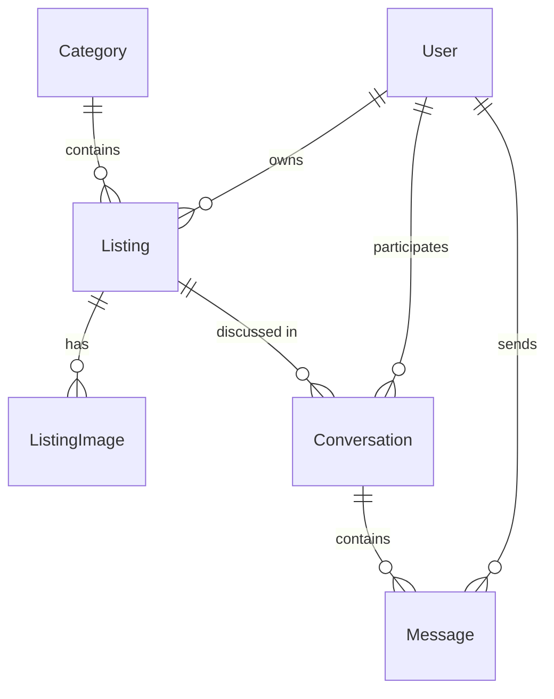

# AgoraFold Project Spec

## Summary

A classifieds board app: users post listings under categories, browse/search/filter listings, and message each other about them. One shared EF Core + PostgreSQL domain model backs multiple independent ASP.NET front-end variants (see [README](../README.md)); this spec scopes the domain and the first variant, **ASP.NET MVC**. Other variants (Razor Pages, Blazor, Web API + JS, HTMX) are out of scope here and will get their own specs when work on them starts.

## Goals

- A working classifieds board on MVC: accounts, listings with images, search/filter, and buyer-seller messaging.
- A domain model (`AgoraFold.Core`) reusable as-is by every future front-end variant — no MVC-specific concerns leak into it.

## Non-goals

- Payments/transactions, escrow, or any money handling.
- Admin/moderation tooling.
- Other front-end variants — tracked in the README, specced separately later.

## Domain model

Current (`AgoraFold.Core/Entities`):

- `Category` — `Id`, `Name`, has many `Listing`.
- `Listing` — `Id`, `Title`, `Description`, `Price?`, `CreatedAt`, belongs to one `Category`.

Additions needed for this spec's feature scope:

- `User` — account identity. `Id`, `DisplayName`, plus whatever ASP.NET Identity requires. A `Listing` gains an `OwnerId`/`Owner`.
- `ListingImage` — `Id`, `ListingId`, storage path/URL, `SortOrder`. A `Listing` has many `ListingImage`.
- `Conversation` — scoped to one `Listing`, between the listing's owner and one other `User`.
- `Message` — `Id`, `ConversationId`, `SenderId`, `Body`, `SentAt`.

## Features (MVC variant)

### Accounts
- Register / log in / log out (ASP.NET Identity, cookie auth).
- "My listings" page scoped to the signed-in user.

### Listings
- Create / edit / delete a listing (owner only), with a category and 0+ images.
- Browse listings: paginated list, filter by category, keyword search over title/description.
- Listing detail page.

### Images
- Upload one or more images per listing; stored on local disk (path referenced from `ListingImage`) — no cloud storage dependency for this variant.
- First image (by `SortOrder`) is the thumbnail shown in listing lists.

### Messaging
- From a listing detail page, a non-owner can start a conversation with the owner.
- Conversation thread view; reply posts a `Message`.
- Inbox page listing the signed-in user's conversations, newest activity first.

## Architecture notes

- `AgoraFold.Core` stays persistence/domain only: entities, `DbContext`, EF configuration. No MVC types (`ViewResult`, `IActionResult`, etc.) referenced here.
- `AgoraFold.Mvc` depends on `AgoraFold.Core`; controllers map view models to/from Core entities.
- Postgres via `docker-compose.yml` (already set up) is the only supported dev datastore — no SQLite/in-memory fallback.
- Image storage: local filesystem under `wwwroot/uploads/` (or a Mvc-configured path) for now; swapping in blob storage later is an explicit non-goal here.

## Open questions

- Auth: cookie-based ASP.NET Identity assumed above — confirm before scaffolding `User`.
- Image storage path/size limits not yet decided.
- Whether search needs full-text (Postgres `tsvector`) or a simple `ILIKE` is enough for v1.
