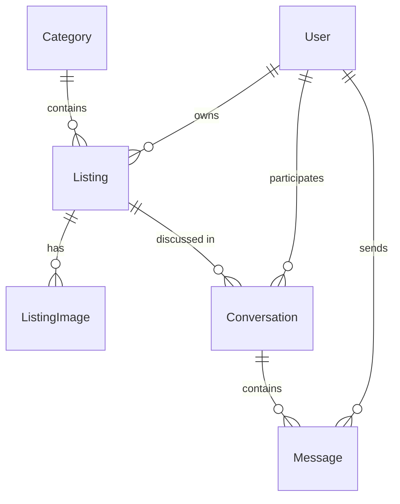

# AgoraFold Project Spec

## Summary

A classifieds board app: users post listings under categories, browse/search/filter listings, and message each other about them. One shared EF Core + PostgreSQL domain model backs multiple independent ASP.NET front-end variants (see [README](../README.md)); this spec defines the shared domain and feature scope, with **ASP.NET MVC** as the reference implementation. Variant-specific architecture details live in their linked design documents.

## Goals

- A working classifieds board on MVC: accounts, listings with images, search/filter, and buyer-seller messaging.
- Real-time buyer-seller chat: newly sent messages are delivered to connected conversation participants over WebSockets.
- A domain model (`AgoraFold.Core`) reusable as-is by every future front-end variant — no MVC-specific concerns leak into it.
- This is a learning exercise (possible portfolio piece), not a production app — no deadline. Each variant gets the full feature set (accounts/images/messaging), not just CRUD, before moving to the next. Planned order: MVC → Razor Pages → Web API + Vue → HTMX → Blazor Server → Blazor WebAssembly → Web API + React → Web API + Svelte → Web API + Angular → Web API + SolidJS.
- HTMX variant: demonstrate hypermedia-driven UI — server returns HTML fragments, HTMX swaps them in, no client-side framework, minimal hand-written JS.
- Blazor Server variant: demonstrate component-based, stateful server rendering — UI updates flow over a live SignalR connection instead of full page POST/redirect/GET cycles.

## Non-goals

- Payments/transactions, escrow, or any money handling.
- Admin/moderation tooling.
- Other front-end variants — tracked in the README and covered by their own architecture documents.
- A JS framework or build step for the HTMX variant (HTMX is vendored as a static file like Bootstrap/jQuery, no Vite/npm bundling).

## Domain model

Current (`AgoraFold.Core/Entities`):

- `Category` — `Id`, `Name`, has many `Listing`.
- `Listing` — `Id`, `Title`, `Description`, `Price?`, `CreatedAt`, belongs to one `Category`.

Additions needed for this spec's feature scope:

- `User` — `IdentityUser` (ASP.NET Identity), extended with `DisplayName`. A `Listing` gains an `OwnerId`/`Owner`.
- `ListingImage` — `Id`, `ListingId`, storage path/URL, `SortOrder`. A `Listing` has many `ListingImage`.
- `Conversation` — scoped to one `Listing`, between the listing's owner and one other `User`.
- `Message` — `Id`, `ConversationId`, `SenderId`, `Body`, `SentAt`.

## Features (MVC variant)

### Accounts
- Register / log in / log out via ASP.NET Identity, cookie auth — confirmed.
- "My listings" page scoped to the signed-in user.

### Listings
- Create / edit / delete a listing (owner only), with a category and 0+ images.
- Browse listings: paginated list, filter by category, keyword search over title/description via `ILIKE` — no full-text search for v1.
- Listing detail page.

### Images
- Upload one or more images per listing; stored on local disk (path referenced from `ListingImage`) — no cloud storage dependency for this variant.
- First image (by `SortOrder`) is the thumbnail shown in listing lists.
- Storage path: `wwwroot/uploads/listings/{listingId}/{guid}{ext}` — GUID filenames avoid collisions and path-traversal from user-supplied names.
- Allowed types: `.jpg`/`.jpeg`/`.png`/`.webp`, validated by file signature (magic bytes) server-side, not just extension/content-type header.
- Limits: 5 MB per file, 8 images per listing; enforced server-side (client-side check is UX-only, not a security boundary).
- No resizing/thumbnailing pipeline for v1 — serve the original, let CSS size the thumbnail. A resize step (e.g. `ImageSharp`) can be added later without changing the storage model.
- Deleting a `Listing` or `ListingImage` deletes its file(s) from disk — otherwise disk usage only grows.

### Messaging
- From a listing detail page, a non-owner can start a conversation with the owner.
- Conversation thread view; the authenticated client maintains a WebSocket connection scoped to the conversation while the thread is open.
- Replying sends a message over the WebSocket; the server authorizes and persists it through the business/service layer, then broadcasts the new `Message` to the conversation's connected participants so the thread updates without a page reload or polling.
- The server authorizes the WebSocket and every message against the conversation participants; clients reload persisted history after reconnecting before resuming live delivery.
- Inbox page listing the signed-in user's conversations, newest activity first.

## Architecture notes

- `AgoraFold.Core` stays persistence/domain only: entities, `DbContext`, EF configuration. No MVC types (`ViewResult`, `IActionResult`, etc.) referenced here.
- `AgoraFold.Mvc` depends on `AgoraFold.Core`; controllers map view models to/from Core entities.
- Real-time messaging transport belongs to the hosting/API layer, not `AgoraFold.Core`. The server persists a message first through the shared service layer, then publishes a WebSocket message event to authorized participants. Front-end variants may adapt the connection lifecycle to their rendering model, but must preserve the same authorization, persistence, and reconnect behavior.
- Postgres via `docker-compose.yml` (already set up) is the only supported dev datastore — no SQLite/in-memory fallback.
- Image storage: local filesystem under `wwwroot/uploads/` (or a Mvc-configured path) for now; swapping in blob storage later is an explicit non-goal here.

## Open questions

- HTMX variant: whether `hx-boost` gets applied globally (boosting all normal links/forms into AJAX navigations) or left off in favor of only using HTMX explicitly where a partial genuinely helps — leaning toward leaving it off, since the point of this variant is showing deliberate partial updates, not turning the whole app into a pseudo-SPA.
- Blazor Server variant: whether pagination/filter state on Browse should keep syncing to the URL via `NavigationManager.NavigateTo` (implemented) long-term vs. simplifying to component-local state only — not a blocker, current behavior gives shareable/bookmarkable browse links same as Mvc's query-string approach.
